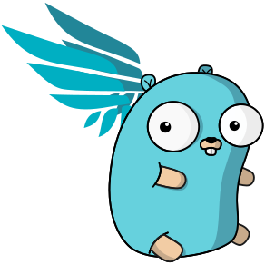

# 

In the previous scenario, [Practical example of Kubernetes runtime security with Falco](https://katacoda.com/falco/courses/falco/forensics-k8s), you learned how to investigate what happens with a defunct pod. If you have not done it yet, it is a good idea to complete that scenario before going on with this one.

Investigating issues is interesting, but it would be remarkable if Falco automatically executed a specific action to respond to a security threat.

This feature is called " _response engine_".

- _[Falco](http://falco.org/)_ monitors containers and processes to alert on unexpected behavior. This functionality is defined via runtime policy, built from rules that describe what the system should and should not do.
- [_falcosidekick_](https://github.com/falcosecurity/falcosidekick), takes a Falco event and forwards it to different outputs.
- _[Kubeless](https://kubeless.io/)_, a Kubernetes Function as a Service (FaaS) framework, receives the security events and executes pre configured playbooks.

A _playbook_ is the piece code executed when an alert is received, it provides an automated, customisable response to the trigger event.

- sending an alert to Slack
- stop the pod, by killing the container
- taint the specific node where the pod is running
