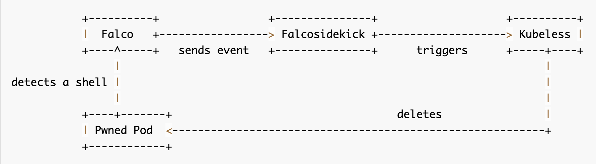

# Install our Kubeless function

Refer to the official [guide](https://kubeless.io/docs/) on how to write Kubeless functions.

Our basic function receives events from Falco thanks to Falcosidekick, check if the triggered rule is Terminal Shell in container (See [rule](https://github.com/falcosecurity/falco/blob/0d7068b048772b1e2d3ca5c86c30b3040eac57df/rules/falco_rules.yaml#L2063)), extract the namespace and pod name from fields of events and delete the according pod:

```bash
from kubernetes import client,config

config.load_incluster_config()

def delete_pod(event, context):
    rule = event['data']['rule'] or None
    output_fields = event['data']['output_fields'] or None

    if rule and rule == "Terminal shell in container" and output_fields:
        if output_fields['k8s.ns.name'] and output_fields['k8s.pod.name']:
            pod = output_fields['k8s.pod.name']
            namespace = output_fields['k8s.ns.name']
            print (f"Deleting pod \"{pod}\" in namespace \"{namespace}\"")
            client.CoreV1Api().delete_namespaced_pod(name=pod, namespace=namespace, body=client.V1DeleteOptions())
```

Outline of the process:



Before deploying our function, we need to create a ServiceAccount for it, as it will need the right to delete a pod in any namespace:

```bash
cat <<EOF | kubectl apply -n kubeless -f -
apiVersion: v1
kind: ServiceAccount
metadata:
  name: falco-pod-delete
---
kind: ClusterRole
apiVersion: rbac.authorization.k8s.io/v1
metadata:
  name: falco-pod-delete-cluster-role
rules:
  - apiGroups: [""]
    resources: ["pods"]
    verbs: ["get", "list", "delete"]
---
kind: ClusterRoleBinding
apiVersion: rbac.authorization.k8s.io/v1
metadata:
  name: falco-pod-delete-cluster-role-binding
roleRef:
  kind: ClusterRole
  name: falco-pod-delete-cluster-role
  apiGroup: rbac.authorization.k8s.io
subjects:
  - kind: ServiceAccount
    name: falco-pod-delete
    namespace: kubeless
EOF
```{{execute}}

And this is the output we get after we create it:

```bash
namespace: kubelessetetion.k8s.io
serviceaccount/falco-pod-delete created
clusterrole.rbac.authorization.k8s.io/falco-pod-delete-cluster-role created
clusterrolebinding.rbac.authorization.k8s.io/falco-pod-delete-cluster-role-binding created
```

Only remains the installation of our function itself:

```bash
cat <<EOF | kubectl apply -n kubeless -f -
apiVersion: kubeless.io/v1beta1
kind: Function
metadata:
  finalizers:
    - kubeless.io/function
  generation: 1
  labels:
    created-by: kubeless
    function: delete-pod
  name: delete-pod
spec:
  checksum: sha256:a68bf570ea30e578e392eab18ca70dbece27bce850a8dbef2586eff55c5c7aa0
  deps: |
    kubernetes>=12.0.1
  function-content-type: text
  function: |-
    from kubernetes import client,config

    config.load_incluster_config()

    def delete_pod(event, context):
        rule = event['data']['rule'] or None
        output_fields = event['data']['output_fields'] or None

        if rule and rule == "Terminal shell in container" and output_fields:
            if output_fields['k8s.ns.name'] and output_fields['k8s.pod.name']:
                pod = output_fields['k8s.pod.name']
                namespace = output_fields['k8s.ns.name']
                print (f"Deleting pod \"{pod}\" in namespace \"{namespace}\"")
                client.CoreV1Api().delete_namespaced_pod(name=pod, namespace=namespace, body=client.V1DeleteOptions())
  handler: delete-pod.delete_pod
  runtime: python3.7
  deployment:
    spec:
      template:
        spec:
          serviceAccountName: falco-pod-delete
EOF
```{{execute}}

This is what we get after a suscessfull installation:

```bash
function.kubeless.io/delete-pod created
```

Here we are, after a few moments, we have a Kubeless function running in namespace kubeless and that can be triggered by its service delete-pod on port 8080:

`kubectl get pods -n kubeless`{{execute}}

```bash
NAME                                          READY   STATUS    RESTARTS   AGE
kubeless-controller-manager-99459cb67-tb99d   3/3     Running   3          3d14h
delete-pod-d6f98f6dd-cw228                    1/1     Running   0          2m52s
```

And executing `kubectl get svc -n kubeless`{{execute}}:

Will return:

```bash
NAME         TYPE        CLUSTER-IP      EXTERNAL-IP   PORT(S)          AGE
delete-pod   ClusterIP   10.43.211.201   <none>        8080/TCP         4m38s
```
