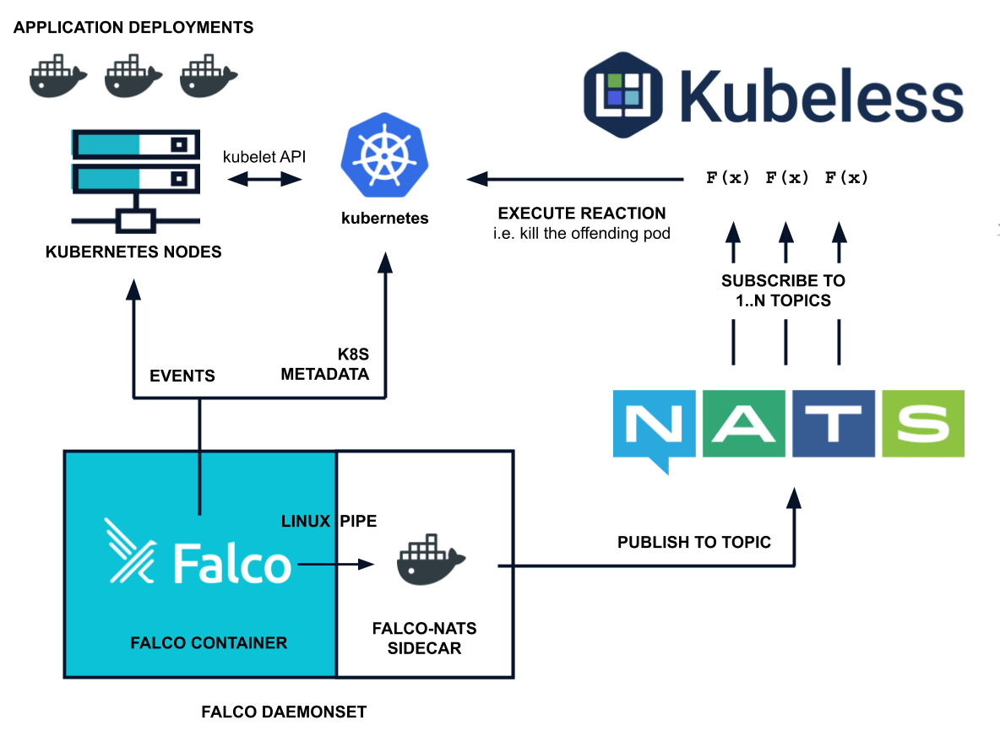

Being able to investigate an issue was nice, but what would be truly great is if, somehow, Falco automagically executed a certain action to respond to a security threat.

This is called a _response engine_. It works like this:

- _[Falco](https://falco.org/)_ monitors containers and processes to alert on unexpected behavior. This is defined through the runtime policy built from multiple rules that define what the system should and shouldn't do.
- _falco-nats_ forwards the alert to a message broker service, into a topic compound by `falco.<severity>.<rule_name_slugified>`.
- _[NATS](https://nats.io/)_, our message broker, delivers the alert to any subscribers to the different topics.
- _[Kubeless](https://kubeless.io/)_, a Function as a Service (FaaS) framework that runs in Kubernetes, receives the security events and executes the configured playbooks.

A _playbook_ is the piece code executed when an alert is received to respond to that threat in an automated way. Some examples include:

- sending an alert to Slack
- stop the pod killing the container
- taint the specific node where the pod is running

