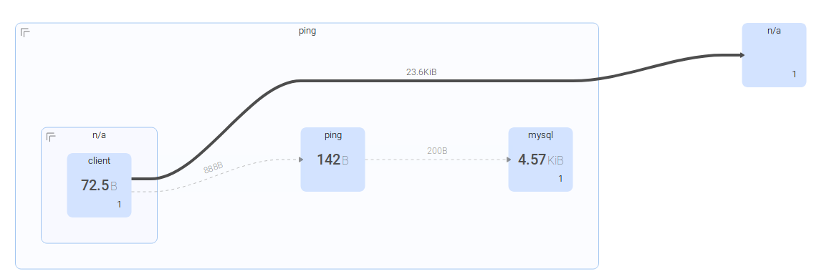
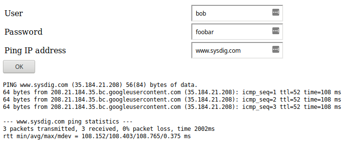
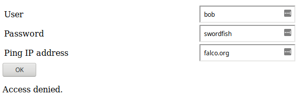

You will create three pods (client, mysql, and ping) for this workshop:

- The `mysql` pod hosts a database of users and passwords.
- The `ping` pod hosts a form written in PHP, which allows authenticated users to ping a machine.
- You will use the `client` pod to send HTTP requests to `ping`'s web server.



```
kubectl create namespace ping
kubectl create -f mysql-deployment.yaml --namespace=ping
kubectl create -f mysql-service.yaml --namespace=ping
kubectl create -f ping-deployment.yaml --namespace=ping
kubectl create -f ping-service.yaml --namespace=ping
kubectl create -f client-deployment.yaml --namespace=ping
```{{execute}}

As usual, make sure the pods are ready (it may take one or two minutes):

`kubectl get pods -n ping`{{execute}}

You can access the Ping web application [here](https://[[HOST_SUBDOMAIN]]-31337-[[KATACODA_HOST]].environments.katacoda.com/ping.php).

You can use the username `bob` and password `foobar` to ping any machine on the Internet.



If you enter an incorrect password, access will be denied.



Now you will do the same, but from the `client` pod.  Let's send a request to the Ping application to ping localhost:

`kubectl exec client -n ping -- curl -F "s=OK" -F "user=bob" -F "passwd=foobar" -F "ipaddr=localhost" -X POST http://ping/ping.php`{{execute}}

Of course, access should be denied to users without proper credentials:

`kubectl exec client -n ping -- curl -F "s=OK" -F "user=bob" -F "passwd=wrongpassword" -F "ipaddr=localhost" -X POST http://ping/ping.php`{{execute}}
