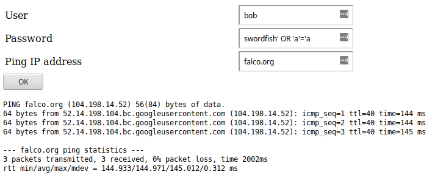
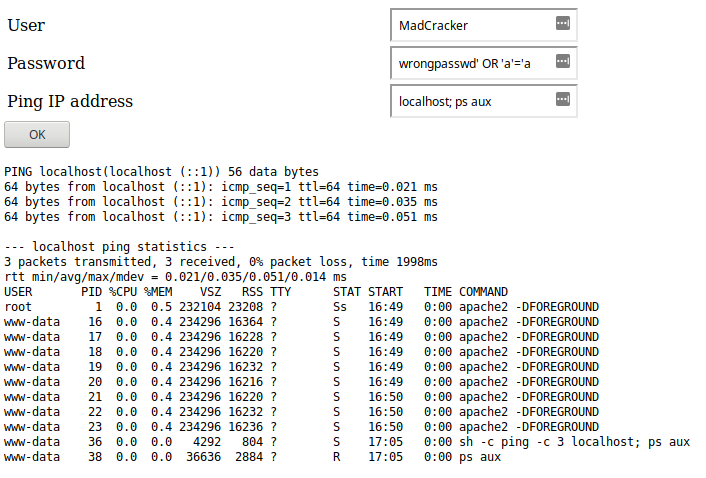

Adding Custom Rules to Falco
----------------------------

Before attacking the web application, you will add a few custom rules to Falco. These rules will be explained shortly:

`helm upgrade falco falcosecurity/falco -f custom_rules.yaml -n falco`{{execute}}

The Falco pod has to be recreated, so wait until it reaches `Running` state:

`kubectl get po -n falco`{{execute}}

SQL Injection attack
--------------------

It turns out our web application is faulty and susceptible to [SQL injection](https://en.wikipedia.org/wiki/SQL_injection) attacks:



`kubectl exec client -n ping -- curl -F "s=OK" -F "user=bad" -F "passwd=wrongpasswd' OR 'a'='a" -F "ipaddr=localhost" -X POST http://ping/ping.php`{{execute}}

An attacker can bypass the authentication mechanism and use the application without knowing the password!

Not only that, he can even **execute arbitrary commands**:



`kubectl exec client -n ping -- curl -F "s=OK" -F "user=bad" -F "passwd=wrongpasswd' OR 'a'='a" --form-string "ipaddr=localhost; ps aux" -X POST http://ping/ping.php`{{execute}}

The attacker could easily get the **source code** for our ping app, which contains the **database credentials**:

`kubectl exec client -n ping -- curl -F "s=OK" -F "user=bad" -F "passwd=wrongpasswd' OR 'a'='a" --form-string "ipaddr=localhost; cat /var/www/html/ping.php" -X POST http://ping/ping.php`{{execute}}

Detection with Falco
--------------------

Falco helps you detecting this kind of attacks thanks to this custom rule:

```yaml
- rule: Unauthorized process
  desc: There is a running process not described in the base template
  condition: spawned_process and container and k8s.ns.name=ping and not proc.name in (apache2, sh, ping)
  output: Unauthorized process (%proc.cmdline) running in (%container.id)
  priority: ERROR
  tags: [process]
```

In the rule condition, you can see that some macros are being used: `spawned_process` and `container`. You can take this [Falco lab](https://katacoda.com/falco/courses/falco/falco) to learn about them (if you haven't done it yet).

Notice how **Kubernetes metadata** is used: `k8s.ns.name=ping`.
Other fields could also be used, such as `k8s.deployment.name`. You can find all the available fields in the [documentation](https://falco.org/docs/rules/supported-fields/).

Take a look at the logs generated by Falco:

`kubectl logs --selector app=falco -n falco | grep Error`{{execute}}

You should see something like:

`18:37.06.570052961: Error Unauthorized process (cat /var/www/html/ping.php) running in (f34f277537e4) k8s.ns=ping k8s.pod=ping-5dffbc654-qrr6m container=f34f277537e4`

<!-- 18:30:15.598654643: Error Unauthorized process (cat /var/www/html/ping.php) running in (4e77e029f60e) k8s.ns=ping k8s.pod=ping-6558497bf-mp7q8 container=4e77e029f60e -->

You could [configure a custom programmatic output](https://falco.org/docs/alerts/) to send notifications to *event and alerting systems* in your organization.
